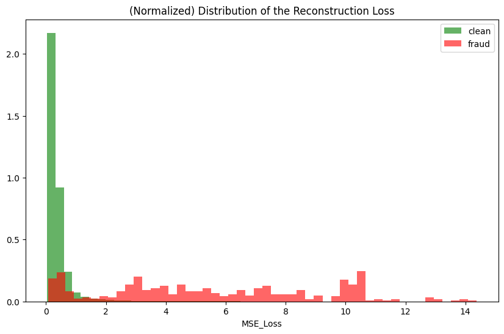

# Credit Card Fraud Anamoly detection

Class Imbalance: 99.82 - o.18

## preprocessing

Feature_engineering
    added the following variables
        'is_round' - derived from the decimal value of Amount - intuition "fraudster might prefer round number or stay away from round numbers. both will be reflected in the Amount variable"

    log_amount - p1log transformation of amount variable to get it to normal distribution

Rest of the variables are masked and hence couldn't be creative with them

## Further Ideas

During initial analyses frauds seems to come in clusters with big spaces in between

Moving average of frauds across Time

## Ideas for modelling

Unsupervised

1. Isolation Forest

2. Autoencoders

3. One-class SVM

Supervised

1. train a neural network - at first with an equal distribution of data at the start and gradually moving to the actual distributions in later training instances.

If supervised techniques are used, then data imbalance must be handled.

## Tactics for class imbalance

Undersampling

Oversampling

mixed-sampling - challenge is model learns a different distribution than the actual one

## comments on ideas

Autoencoders don't need oversampling as they don't look at minority class.

For isolation forest, oversampling might be counter-productive as the model tries to isolate anamolies. When spatial based imputing is done, it effectively means points are added near to other anamolies making it difficult for the isolation forest to isolate the points. Dimensionality reduction might be a good idea.

One-class SVM might be a good idea after a feature reduction step through t-SNE or UMAP. Oversampling is needed.

Training a neural network with equal distibution at first and later moving to actual distribution is a decent idea. However, it is not my first choice right now. It's worth trying it but I wouldn't bet on it over others

Results with Autoencoder

Ideally the thresh should be determined from the training data results
It should be selected in such a way that most of the fraud cases are caught while still keeping the false positives to a minimum.

i.e. maximise the fraud detection while minimising false positives

If we draw a vertical line at any threshold point we get the relevant fraud detection accuracy and the cost (false detection rate)

Since we are sensitive to fraud detection, we might want to capture a lot more fraud cases.
looking at the graphs 2.8 seems like a good number

